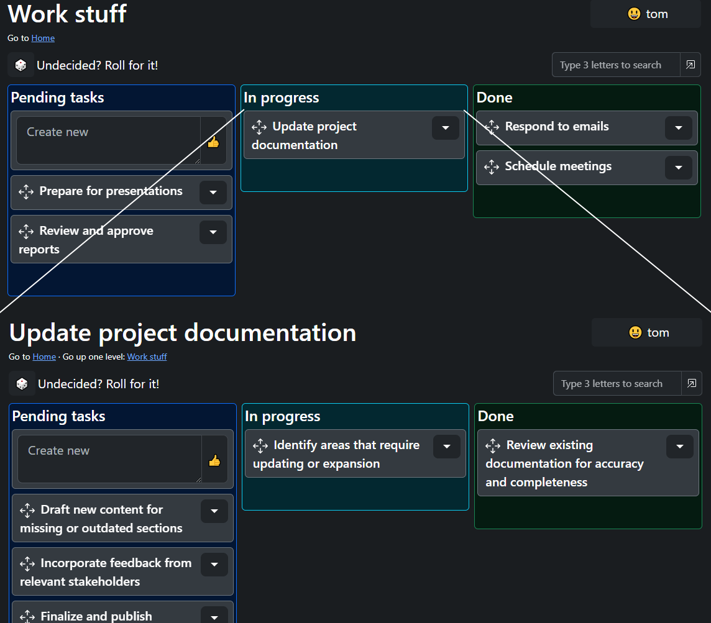

<h1> kankan</h1>

### Get the ball rolling.
#### All progress is good progress.
#### Visualize your objectives and break them down as much as you need.
#### Start with small steps and track every achievement.
#### Record your journey so you can look back and stay motivated.

#### 🧩 Infinitely nested kanbans. 
Break down any objective into bite-sized steps. Organize your thoughts and create a clear path to completion, no matter how big the goal.

#### 🕊️ Simplicity works. 
Ditch the clutter and focus on what matters. Scoped visualization and minimalist design makes managing your tasks effortless.

#### 🏃 Stay motivated wherever you go. 
Track progress anytime, anywhere. Quickly access from any device, so you never miss a beat.

#### 🧙‍♂️ Free and open source. 
Forever.

🤝 This project wouldn't be possible without the open source community:

[Python](https://python.org) · [django](https://www.djangoproject.com/) · [htmx](https://htmx.org/) · [Bootstrap](https://getbootstrap.com/) · [SortableJS](https://sortablejs.github.io/Sortable/) · [canvas-confetti](https://catdad.github.io/canvas-confetti/)

#### 🧉 Made in Argentina

#### 💖 You can support the project here: https://ko-fi.com/tpjelf